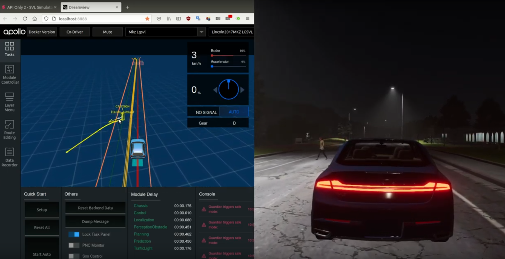

# ScenarioGenerator
*ScenarioGenerator* performs search-based software testing of [Baidu Apollo](https://apollo.auto) by automatic generation of various traffic scenarios in [SVL end-to-end autonomous vehicle.](https://www.svlsimulator.com) to verify and validate the safety functionality of Apollo autonomous systems.


- Scenario Creation using SVL editor: [This video demonstrates how `simplePedestrian.json` scenario is created.](https://www.youtube.com/watch?v=4L48mTJo2eo&list=PLDs7zRhHsnSQzPShKLLaiLJvybV2HVtAS)
- ScenarioGenerator: [This video demonstrates `ScenarioGenerator.py` in action.](https://www.youtube.com/watch?v=GOtpSJodlmo&list=PLDs7zRhHsnSQzPShKLLaiLJvybV2HVtAS)
- Safety violation/failures: [This video presents the safety violations that are detected.](https://www.youtube.com/watch?v=6PokmSRsj3Y&list=PLDs7zRhHsnSQzPShKLLaiLJvybV2HVtAS)


[](https://www.youtube.com/watch?v=GOtpSJodlmo&list=PLDs7zRhHsnSQzPShKLLaiLJvybV2HVtAS)


If the code helps your research please cite our paper (["Efficient and Effective Generation of Test Cases for Pedestrian Detection – Search-based Software Testing of Baidu Apollo in SVL"](resourcdes/IEEE_AV_Test_Challenge.pdf) ) presented at [AITest 2021 : The IEEE Third International Conference On Artificial Intelligence Testing](http://www.ieeeaitests.com/) in the [Autonomous Driving AI Test Challenge](http://av-test-challenge.org) track.

Find more information about the challenge [in this directory](resources/AITest2021).


## Setup
##### Apollo: 

```
$ git branch r6.0.0
$ bash docker/scripts/dev_start.sh
$ bash docker/scripts/dev_into.sh
## For DEV ONLY (implemented in restart_apollo() function):
# in-dev-docker:/apollo]$ bootstrap_lgsvl.sh stop && bootstrap_lgsvl.sh 
# in-dev-docker:/apollo]$ bridge.sh
```
Activate the following modules in dreamview: planning - perception transformation routing, localization, control

##### SVL simulator:
First, configure the sensors as explained in [1](https://www.svlsimulator.com/docs/getting-started/getting-started/), [2](https://www.svlsimulator.com/docs/tutorials/modular-testing/). Start the SVL simulator in API-only mode. 


##### Scenario Generator:

Install [SVL python API](https://github.com/lgsvl/PythonAPI) and then you can either edit and use `start.sh` to use the default settings or manually specify the command line arguments for ScenarioGenerator:

```
usage: ScenarioGenerator.py [-h] -i INPUT --action ACTION
                            [--vector VECTOR [VECTOR ...]]
                            [--des-forward-right DES_FORWARD_RIGHT DES_FORWARD_RIGHT]
                            [--seed SEED] [--steps STEPS]
                            [--pos-noise-range-xz POS_NOISE_RANGE_XZ POS_NOISE_RANGE_XZ]
                            [--color-noise-range-rgb COLOR_NOISE_RANGE_RGB COLOR_NOISE_RANGE_RGB COLOR_NOISE_RANGE_RGB]
                            [--weather-noise-range WEATHER_NOISE_RANGE WEATHER_NOISE_RANGE WEATHER_NOISE_RANGE WEATHER_NOISE_RANGE WEATHER_NOISE_RANGE]
                            [--time-max-noise TIME_MAX_NOISE]
                            [--speed-max-noise SPEED_MAX_NOISE]
```

For each scenario, a new JSON file is created in the `results` directory. Take a look at `replay.sh` to get an idea of how to replay these JSON scenario files.


##### cleanup.sh script

Remove files and folders in the following directories:

- `results` folder
- SVL test results
- Apollo core files
- `.config/unity3d/LGElectronics/SVLSimulator/Analysis`  & `videos`

### Credits

If you use [ScenarioGenerator](https://github.com/ebadi/ScenarioGenerator) or got inspired by our paper ([Efficient and Effective Generation of Test Cases for Pedestrian Detection – Search-based Software Testing of Baidu Apollo in SVL](resources/IEEE_AV_Test_Challenge.pdf)), please link to this project and cite our paper.

```
@inproceedings{scenariogenerator,
  title = {Efficient and Effective Generation of Test Cases for Pedestrian Detection – Search-based Software Testing of Baidu Apollo in SVL},
  author = {Hamid Ebadi and Mahshid Helali Moghadam and Markus Borg and Gregory Gay and Afonso Fontes and Kasper Socha},
  booktitle = {IEEE AITest 2021},
  year = {2021}
}
```

This work is done by [Infotiv AB](https://www.infotiv.se) under [VALU3S](https://valu3s.eu) project in a collaboration with [RISE](https://www.ri.se) under [ITEA3](https://itea4.org) European [IVVES](https://itea4.org/project/ivves.html) project. This project has received funding from the [ECSEL](https://www.ecsel.eu) Joint Undertaking (JU) under grant agreement No 876852. The JU receives support from the European Union’s Horizon 2020 research and innovation programme and Austria, Czech Republic, Germany, Ireland, Italy, Portugal, Spain, Sweden, Turkey.

INFOTIV AB | RISE Research Institutes of Sweden | CHALMERS | Mälardalen University |
------------ |  ------------  | ------------ | ------------ 
  |   |  |  

[ScenarioGenerator](https://github.com/ebadi/ScenarioGenerator) project is started and is currently maintained by Hamid Ebadi.
